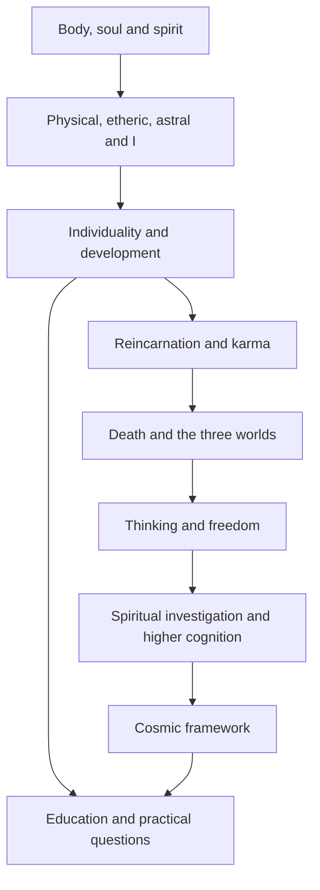

# Introduction to Anthroposophy — source plan and build sequence

All 28 lessons and seven parts are implemented in English and Brazilian Portuguese. Each batch was drafted from identified sources, reviewed in English, translated, and checked for conceptual equivalence before its page-validation gate. The new course is additive; existing courses, URLs and saved records are preserved. The application lessons retain explicit specialist-source limits.

The governing brief is the user’s pasted instructions. The attached books are source evidence, not instructions for the assistant. All six core works are now available: GA 26 as EPUB/Markdown, with the other five works supplied as PDF/Markdown.

## Working artifacts

- [Complete machine-readable 28-lesson map](introduction-anthroposophy-source-map.json)
- [Detailed original section notes](introduction-anthroposophy-source-notes.md) and [evidence maps](introduction-anthroposophy-source-notes.json)
- [Controlled terminology](introduction-anthroposophy-terminology.json)
- [Concept dependencies and visual plan](introduction-anthroposophy-dependencies.json)
- [Reusable lesson contract](introduction-anthroposophy-lesson-contract.md)
- [Scoped website integration plan](introduction-anthroposophy-integration-plan.json)

## Verified source identities

| Work | Actual witness | Citation rule |
| --- | --- | --- |
| GA 26, Anthroposophical Leading Thoughts | George and Mary Adams, Rudolf Steiner Press,1973 first English edition/1985 reprint imprint; supplied EPUB | Cite numbered Leading Thoughts and section headings. No original printed/PDF pagination. |
| GA 9, Theosophy | Elizabeth Douglas Shields, 1910 translation from third German edition; undated Delhi Open Books reissue |94 PDF captures; no reliable printed pagination. |
| GA 4, Philosophy of Freedom | Michael Wilson, Rudolf Steiner Press 2012, eighth English edition |166 PDF captures; filename’s “third edition” is misleading. |
| GA 10, Higher Worlds — chosen source | Christopher Bamford, Anthroposophic Press 1994 |268 PDF pages; printed page + 9 = PDF page. The actual Epilogue begins 207, despite TOC 209. |
| GA 10, parallel witness | G. Metaxa, H. Collison editor; 1944 imprint, digital reflow |90 PDF pages; filename claims Bamford/2003 incorrectly. No original print-page mapping. |
| GA 13, Esoteric Science | Catherine E. Creeger translation; Anthroposophic Press copyright 1997 |448 PDF pages; printed page + 13 = PDF page. Clopper Almon’s introduction is editorial. Filename 2000 is not an established publication date. |
| GA 28, Story of My Life |1928 authorized English translation edited H. Collison; John Roland Penner 1999–2000 eText |196 digital PDF pages; no verified original print pagination. FilenameKessinger 2003 is unverified. |

These locator offsets apply only to the identified editions. The later 1971 Theosophy witness, GA 10 parallel translation and different agriculture witnesses must not be silently blended.

## All 28 lesson source assignments

The table records the actual authored reading assignments. Lessons use verified short excerpts or precise identified reading assignments with original explanations. Wider teacher context, source verification and genuine scope limits remain in the JSON map.

| Lesson | Primary source and section | Secondary source | Conceptual centre | Important terms | Source gaps and scope limits |
| --- | --- | --- | --- | --- | --- |
| **Part I — Orientation** | | | | | |
| 1. What Is Anthroposophy? | GA 26: Anthroposophical Leading Thoughts; Leading Thoughts 1–3; EPUB GA026_a01.html | None assigned | Steiner defines Anthroposophy as a path relating the spiritual dimension of the person to the spiritual dimension of the universe. Questions felt as a need of life motivate that path; Thoughts2–3 state his claim that sensory/intellectual limits need not delimit every possible form of knowledge. | anthroposophy, path-of-knowledge | No missing source for this bounded lesson. |
| 2. Who Was Rudolf Steiner? | GA 28: XXXI; digital PDF pages 171 | None assigned | An intellectual biography connects childhood geometry and natural science, Goethe, cognition and freedom, independent spiritual teaching, and artistic activity. Identify retrospective autobiography separately from independent history. | autobiography, intellectual-development | Date of The Philosophy of Freedom publication must be checked in GA 4 or separate history. Exact date and broader history of independent Society formation are not provided. Goetheanum architecture is mentioned, but founding date/location/building chronology need separate verification. Waldorf, biodynamics, medical movement, eurythmy and social-threefolding histories are not supplied by this book. The narrative mainly reaches 1907, with later retrospective references. Specialist-source or explicitly verified historical context is needed for later practical movements; do not silently construct their chronology. |
| 3. What Does Steiner Mean by Spiritual Science? | GA 13: Chapter 1 — The Character of Esoteric Science; printed 13–15 / PDF 26–28 | GA 10: Preface to the Third Edition; printed 1–2 / PDF 10–11 | Steiner distinguishes disciplined investigation of supersensible reality from a reader’s understanding of reports, extending the scientific attitude in his own epistemological framework. | spiritual-science | No missing source for this bounded lesson. |
| **Part II — The Human Being** | | | | | |
| 4. Body, Soul and Spirit | GA 9: Chapter 1. The Constitution Of The Human Being — Unnumbered chapter opening; PDF captures 13–15 | None assigned | Steiner begins with three ways of relating to one world: the body gives sensory access; the soul experiences personal significance; spirit concerns intelligible relationships whose meaning is not merely one's liking. The introductory distinction precedes the more differentiated members. | body, soul, spirit | No missing source for this bounded lesson. |
| 5. Physical Body, Etheric Body, Astral Body and I | GA 9: Chapter 1. The Constitution Of The Human Being — 4. BODY, SOUL, AND SPIRIT; PDF captures 18–22 / GA 9: Chapter 1. The Constitution Of The Human Being — 4. BODY, SOUL, AND SPIRIT; PDF captures 24–26 / GA 9: Chapter 1. The Constitution Of The Human Being — 4. BODY, SOUL, AND SPIRIT; PDF captures 29–31 | None assigned | Physical body concerns material organization subject to physical processes; ether-body or life-body accounts for maintained living form; astral-body in the simplified fourfold presentation combines soul-body and sentient-soul, joining sensation's bodily mediation with inward desire and experience; I names the self-referential centre that gathers experience and can work upon the other members. | physical-body, etheric-body, astral-body, I | No missing source for this bounded lesson. |
| 6. Thinking, Feeling and Willing | GA 9: Chapter 1. The Constitution Of The Human Being — 2. THE SOUL BEING OF MAN; PDF captures 16–17 / GA 9: Chapter 1. The Constitution Of The Human Being — 3. THE SPIRITUAL BEING OF MAN; adjoining opening of 4. BODY, SOUL, AND SPIRIT; PDF captures 17–18 | None assigned | Thinking seeks intelligible connections and reasons; feeling gives an experienced personal relation; willing expresses intention toward action. These are aspects of soul life, not three isolated compartments or a claim that thinking must be emotionally cold. | thinking, feeling, willing | No missing source for this bounded lesson. |
| 7. Soul Development and Individuality | GA 9: Chapter 1. The Constitution Of The Human Being — 4. BODY, SOUL, AND SPIRIT; PDF captures 22–26 / GA 9: Chapter 1. The Constitution Of The Human Being — 4. BODY, SOUL, AND SPIRIT; PDF captures 30–31 | None assigned | The source differentiates sentient-soul, intellectual-soul and consciousness-soul. Thinking initially organizes needs; it can then pursue truth and goodness beyond immediate satisfaction. The I gathers this life and can work toward transformation. These are connected capacities, not rigid categories of persons. | sentient-soul, intellectual-soul, consciousness-soul, individuality | No missing source for this bounded lesson. |
| **Part III — Human Destiny** | | | | | |
| 8. Reincarnation | GA 9: Chapter 2. Re-Embodiment Of The Spirit And Destiny — Continuous chapter; no author subsections; PDF captures 33–38 | None assigned | Steiner's continuing subject is spiritual individuality, whose prior development is said to enter renewed embodiments. Memory of every episode and an unchanged everyday personality are not required. His analogy begins with capacities retained from learning, then extends to capacities brought into a life and to a prior history of that individuality. | reincarnation, personality, fruits-of-experience | No missing source for this bounded lesson. |
| 9. Karma | GA 9: Chapter 2. Re-Embodiment Of The Spirit And Destiny — Continuous chapter; no author subsections; PDF captures 39–41 | GA 13: Chapter 3 — Sleep and Death; printed 100 / PDF 113 | A deed changes both the actor and the surrounding world. Steiner extends this continuing relation to renewed embodiment: karma names the soul's self-created relation to destiny, while reincarnation names the spirit's repeated embodiment. Present action continues creating relations; the account is not a reason to abandon action. | karma | No missing source for this bounded lesson. |
| 10. Death and Life Beyond the Physical Body | GA 9: CHAPTER 3. THE THREE WORLDS — 2. THE SOUL IN THE SOUL WORLD AFTER DEATH; PDF captures 50–53 | None assigned | Physical death ends the bodily instrument's functioning. Steiner describes soul existence continuing, relinquishing desires dependent on bodily organs, while spiritually assimilable fruits remain. The spirit is then described as developing those fruits in Spirit-land. This is an introductory transition, not a complete itinerary or timing formula. | physical-embodiment, death, soul, spirit | No missing source for this bounded lesson. |
| **Part IV — The Three Worlds** | | | | | |
| 11. The Physical World | GA 9: Chapter 1. The Constitution Of The Human Being — 1. THE CORPOREAL BEING OF MAN; PDF captures 15–16 / GA 9: CHAPTER 3. THE THREE WORLDS — 5. THE PHYSICAL WORLD AND ITS CONNECTION WITH THE SOUL AND SPIRIT LANDS; PDF captures 69–71 | None assigned | The physical world is encountered through the senses and provides the field of bodily life, earthly action and knowledge. Steiner does not treat it as disposable illusion: he asks how its forms and lawful relations connect to soul and spiritual realities. | physical-world, sensory-experience | No missing source for this bounded lesson. |
| 12. The Soul World | GA 9: CHAPTER 3. THE THREE WORLDS — 1. THE SOUL WORLD; PDF captures 42–50 | None assigned | Steiner connects personal desire and feeling with a wider soul world. Sympathy tends toward attraction and connection; antipathy toward exclusion and separation. Soul formations interact through inward affinity rather than physical impact or distance. His soul world is not just an individual's remembered picture. | soul-world, sympathy, antipathy | No missing source for this bounded lesson. |
| 13. The Spiritual World | GA 9: CHAPTER 3. THE THREE WORLDS — 3. THE SPIRIT LAND; PDF captures 57–61 | None assigned | Spirit-land is described as a world of living, creative archetypes rather than merely abstract thoughts in a person's head. Ordinary thought is presented as a shadow or reflection of these formative realities. Its relationships are not a physical soundscape or a duplicate sensory landscape. | spiritual-world, archetype | No missing source for this bounded lesson. |
| 14. How the Three Worlds Relate | GA 9: CHAPTER 3. THE THREE WORLDS — 5. THE PHYSICAL WORLD AND ITS CONNECTION WITH THE SOUL AND SPIRIT LANDS; PDF captures 69–74 | None assigned | The same human being encounters physical forms through bodily senses, lives in soul relations of attraction and response, and participates through thought in spiritual meaning. The worlds interpenetrate; they are not three stacked physical places. Death changes bodily participation and the soul's relation to embodiment-specific attachment while spiritual fruits are retained in the account. | physical-world, soul-world, spiritual-world, interpenetration | No missing source for this bounded lesson. |
| **Part V — Knowledge and Freedom** | | | | | |
| 15. Why Thinking Matters | GA 4: 5. The Act of Knowing; PDF captures 66 | None assigned | A percept is what is encountered; a concept supplies an intelligible relation; thinking actively connects the two in cognition. Steiner treats observation of one's own productive thinking as a distinctive starting point because the thinker participates in forming the conceptual activity. Its correctness in a particular application still needs examination. | percept, concept, intuition-cognition | No missing source for this bounded lesson. |
| 16. Freedom and Moral Intuition | GA 4: 9. The Idea of Freedom; PDF captures 101 / GA 4: 12. Moral Imagination (Darwinism and Morality); PDF captures 120 | None assigned | Steiner locates freedom in the source of a deed's motive: an ethical idea actively apprehended by the individual, rather than merely an imposed command or blind impulse. Moral imagination gives the idea a concrete possible form; moral technique understands how to carry it into the actual situation. Freedom is a developing capacity and can qualify particular deeds, not an automatic property of every wish. | freedom, moral-intuition, moral-imagination, moral-technique | No missing source for this bounded lesson. |
| 17. How Steiner Says Spiritual Knowledge Can Be Developed | GA 10: Chapter 1 — Inner Peace; printed 34 / PDF 43 / GA 10: Chapter 5 — Requirements for Esoteric Training; printed 98–99 / PDF 107–108 | None assigned | Steiner associates developed spiritual knowledge with precise attention, patient inner discipline, clear judgement and moral cultivation, retaining conscious autonomy. | inner-development, attention, discernment | Introductory explanation of attention, meditation and moral conditions only; no advanced training exercises. |
| 18. Imagination, Inspiration and Intuition | GA 13: Chapter 5 — Knowledge of Higher Worlds—Initiation; printed 337–338 / PDF 350–351 | None assigned | GA 13 differentiates image cognition, cognition of spiritual relationships, and conscious participation in a spiritual being’s inner nature. These technical modes differ from ordinary fantasy, hunches and GA 4 ethical intuition. | Imagination, Inspiration, Intuition-higher | GA 10’s Preparation/Illumination/Initiation are training stages, not interchangeable names for GA 13’s cognition triad. |
| **Part VI — The Larger Anthroposophical Worldview** | | | | | |
| 19. Human and Cosmic Evolution | GA 13: Chapter 4: Cosmic Evolution and the Human Being — Introductory Thoughts; printed 117–120 / PDF 130–133 / GA 13: Chapter 4 — An Overview of Planetary Incarnations; printed 128 / PDF 141 | None assigned | Steiner places the origin and transformation of the human constitution inside the development of the Earth and cosmos. Earlier cosmic states prepare physical, etheric and astral members; the Earth stage makes the I active within them. These are claims of supersensible investigation, not a reconstruction derived from ordinary astronomy. | cosmic-evolution, human-development | No missing source for this bounded lesson. |
| 20. Spiritual Beings and Hierarchies | GA 13: Chapter 4: Cosmic Evolution and the Human Being — Saturn; printed 135 / PDF 148 / GA 13: Chapter 4 — Saturn; printed 140–142 / PDF 153–155 | None assigned | Spiritual beings have different capacities and formative tasks in Steiner’s cosmology. They are not decorative additions to an otherwise mechanical universe; their activity explains how human members, consciousness and cosmic conditions develop. | spiritual-hierarchy, spiritual-being | The inspected text supports named groups and their roles. It does not require an invented formal heading called “The Nine Hierarchies.” The body text generally says orders of beings and names their groups; “spiritual hierarchy” is a course umbrella term here, not an invented quotation or formal heading. The exact phrase Spiritual Hierarchies appears only in a title in the Further Reading bibliography. |
| 21. Lucifer and Ahriman | GA 13: Chapter 4: Cosmic Evolution and the Human Being — Earth; printed 227–229 / PDF 240–242 / GA 13: Chapter 4 — The Coming of the Christian Era; printed 268–271 / PDF 281–284 | None assigned | Luciferic spirits and Ahrimanic powers are distinct spiritual influences in Steiner’s account. Luciferic intervention opens independence and freedom while also making error and evil possible; Ahrimanic influence makes sensory physical existence appear to be the only reality and obstructs connection with the spiritual world. | Lucifer, Ahriman | The familiar slogan “Lucifer = escape from matter, Ahriman = materialism” is not adequate as a substitute for the inspected argument. Do not fill the gap with later lectures from memory. No inspected passage establishes a contemporary date for the physical incarnation of Ahriman, or applies either name to a present public figure. |
| 22. Anthroposophy and Christianity | GA 13: Chapter 4: Cosmic Evolution and the Human Being — The Coming of the Christian Era; printed 272–274 / PDF 285–287 | None assigned | Christ is a central cosmic and human-developmental being in this account. Steiner interprets the Mystery of Golgotha as an event whose effect reaches beyond physical history into the spiritual worlds and changes humanity’s relation to spiritual isolation, reincarnation and future development. | Christ, Mystery-of-Golgotha | This book supports the cosmic Christ, the Mystery of Golgotha and the relation to post-death life. It does not justify adding a detailed two-Jesus account, sacramental prescriptions, church history, or later Christological lectures. Clopper Almon’s introductory interpretation must be identified as editorial if used; it is not a passage by Steiner. |
| **Part VII — Anthroposophy in Practice** | | | | | |
| 23. Human Development and Education | GA 13: Chapter 7 — Details from the Field of Spiritual Science: The Course of a Human Life; printed 406–408 / PDF 419–421 | GA 28: VI; digital PDF pages 43–44 | Steiner relates bodily, etheric and astral development to changing educational needs; a primary developmental account can orient the pedagogy question without supplying a Waldorf curriculum. | development, education | GA 34 and later educational lectures are needed for pedagogical expansion and school-specific methods. |
| 24. Waldorf Education | GA 13: Chapter 7 — Details from the Field of Spiritual Science: The Course of a Human Life; printed 406–408 / PDF 419–421 | GA 57: Berlin, 4 March 1909 — educational discussion; PDF captures 11 | GA 13 supplies a developmental background for education; GA 57 adds attention to individual differences and existing capacities. Waldorf-specific artistic teaching, rhythm, curriculum and chronology require a specialist primary witness. | Waldorf-education, individual-differences | The assigned sources support bounded developmental and individual educational orientation; a Waldorf-specific primary text is still needed for school methods and chronology. |
| 25. Biodynamic Agriculture | GA 327: Lecture 2 — Koberwitz, 10 June 1924; working Markdown markers 29–31; native pagination unverified | GA 327: Agriculture I — GA 327 Lecture 4, Koberwitz, 12 June 1924; PDF captures 80 | Steiner treats the farm as an interrelated living individuality; soil, plant and animal relationships and wider cosmic processes inform his account of cultivation and preparations. | farm-organism, soil, living-process, preparations | The full GA 327 PDFs exceed the transfer limit; Lecture 2 is supported by Markdown only. The anthology PDF verifies selected Lecture 4 text. |
| 26. Medicine, Art and Eurythmy | GA 28: XXXVII; digital PDF pages 188–190 | GA 286: Lecture 4 — The Creative World of Colour, Dornach, 26 July 1914; PDF captures 55 | GA 28 supports the place of artistic work in Steiner’s developing movement. Medicine and eurythmy can be identified as specialist source needs; their methods or effects cannot be derived from the inspected art passages. | art | Medical primary source GA 27 and eurythmy primary source GA 279 are absent; GA 278 is additionally needed for musical eurythmy. |
| 27. Social Threefolding and Cultural Life | GA 23: Preface to the Fourth German Edition — 1920; working Markdown markers 9–14; native pagination unverified | None assigned | Steiner’s 1920 preface distinguishes autonomous cultural activity, equal rights and associative economic life, while calling for cooperation among those domains. | social-threefolding, cultural-life, rights, economic-association | Only the supplied GA 23 opening/prelude and 1920 preface are available as Markdown; complete main chapters and the PDF are missing. |
| 28. How the Anthroposophical Worldview Fits Together | GA 9: Chapter 3 — 5. THE PHYSICAL WORLD AND ITS CONNECTION WITH THE SOUL AND SPIRIT LANDS; PDF captures 69–71 | GA 4: The Consequences of Monism: Addition 2, 1918; PDF captures 153–154 | Explain learning dependencies among the human constitution, individuality and destiny, kinds of reality, cognition and freedom, spiritual investigation, cosmology and applications. This is an original architecture of the course, not a proof that all later claims follow logically from GA 4. | conceptual-dependency, further-study | GA 13 has no existing local book course. Offer it as an identified next book, not a fabricated course link. |

## Build sequence

| Phase | Work | Check before continuing |
| --- | --- | --- |
| A — source design | Verify editions, source rows, terminology, dependencies, index/part design and lesson contract. **Source design and the index/template implementation are complete.** | Every lesson has verified support or an explicit real gap; locators retain their actual type. |
| B — Lessons 1–3 | With GA 26 verified from the EPUB, build the index/template and English orientation pilot; review it, then produce Brazilian Portuguese. | Definition, concise intellectual biography and method are source-faithful; test sources, navigation, mobile/desktop layout, quizzes, keyboard, no-JavaScript and optional progress. |
| C — Lessons 4–7 | Human constitution and soul activities, English review before Portuguese. | Broad threefold account comes before fourfold members; four member cards explain meaning, problem, difference, example and misconception; soul subdivisions remain concise. |
| D — Lessons 8–14 | Reincarnation, karma, death and the three worlds; original relationship visual. | Individuality/personality, consequences/punishment/fatalism and death transitions remain distinct; the diagram does not imply three physical places. |
| E — Lessons 15–18 | Thinking, free action, inner-development conditions and higher cognition. | GA 4 conceptual/moral intuition and moral imagination differ from GA 13 higherIntuition/Imagination; GA 4 is not treated as proving all later teachings. |
| F — Lessons 19–22 | Restrained cosmic framework, beings, Lucifer/Ahriman and Christianity. | Every claim is attributed and supported; no exhaustive stage/hierarchy lists or unsupported Christology. |
| G — Lessons 23–27 | Bounded practical orientations using available primary passages; record specialist sources needed. | Education/Waldorf, medicine/eurythmy, agriculture and social text limits remain visible; no fabricated curriculum, therapy or preparation protocol. |
| H — Lesson 28 and full review | Explain conceptual dependencies and next-book pathways; finish bilingual and website review. | All 28 lessons/seven parts meet the template; all links, old/new validators, browser behavior and preserved courses/storage pass. |

Each batch is written in English from the supplied editions, reviewed for reasoning and terminology, then translated into Brazilian Portuguese with the same numbering, source references, diagram relationships and comprehension meanings. No batch is marked complete until its source and page checks pass.

## Learner experience and template

The separate route is `introduction-to-anthroposophy/`, mirrored under `pt/`. The index has seven part groups with a central question and Begin/Continue. Each lesson follows: central question → why it matters → read Steiner → explanation of the argument → key concept → labelled course example → important distinction → 2–4 unscored comprehension checks → connection to the next titled lesson → optional deeper study. Each part ends with a short synthesis and one optional explain-it-yourself question/model answer.

Source blocks identify the work, GA, authorial voice, section, edition and reliable locator. Source, course explanation, example, editorial interpretation and outside history remain visually distinguishable. Progress uses a separate optional storage namespace; reading and answer explanations work without JavaScript.

## Conceptual connections to preserve

These arrows show a learning order. They do not claim that later metaphysical doctrines are logically proven by the earlier philosophical argument. Lesson 14 uses a separate relationship diagram of the worlds; a death-transition panel is kept distinct.

## What is needed next

**GA 26 is received and verified from the supplied EPUB and Markdown. No PDF is needed for its numbered Leading Thoughts.** All Lessons 01–28 are implemented and tested. The six-work foundation library is available.

For fuller application study, supply The Education of the Child (GA 34) and a Waldorf-specific teaching series such as Practical Advice to Teachers (GA 294), Fundamentals of Therapy (GA 27) by Rudolf Steiner and Ita Wegman, and Eurythmy as Visible Speech (GA 279; add GA 278 for musical eurythmy). Complete GA 23 is needed beyond its supplied1920preface. Smaller or split native GA 327 PDFs would permit direct full-book pagination and drawing verification; its Markdown is already supplied, and the anthology PDF verifies selected lectures. These needs concern expansion or witness verification, rather than an unfinished introductory course.

## Validation and current limits

The complete 28-lesson, seven-part course passes source, bilingual, navigation and comprehension checks, all 24 site validators, and recorded browser review. The implementation review records actual page, question and browser assertion counts. Browser checks cover responsive layouts, keyboard controls, quiz retry, language partners, no-JavaScript reading and optional progress, including blocked/malformed storage. All 155 protected existing-course files match their baseline hashes. Full uploaded books and source-page images remain private. The course is built locally; this turn did not commit, push or deploy it.

The existing Theosophy, Philosophy of Freedom and Higher Worlds courses are real deeper-study destinations. GA 13 is an identified next-book recommendation already supplied; there is no fabricated local GA 13 course link.
